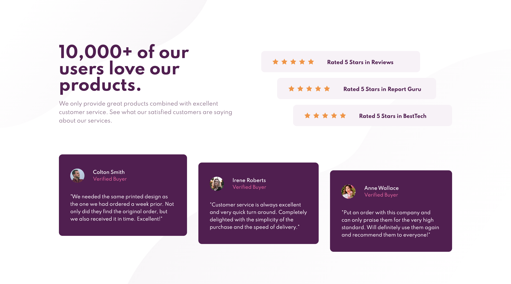

# Frontend Mentor - Social proof section solution

This is a solution to the [Social proof section challenge on Frontend Mentor](https://www.frontendmentor.io/challenges/social-proof-section-6e0qTv_bA). Frontend Mentor challenges help you improve your coding skills by building realistic projects.

## Table of contents

- [Overview](#overview)
  - [The challenge](#the-challenge)
  - [Screenshot](#screenshot)
  - [Links](#links)
- [My process](#my-process)
  - [Built with](#built-with)
  - [What I learned](#what-i-learned)
  - [Useful resources](#useful-resources)
- [Author](#author)

**Note: Delete this note and update the table of contents based on what sections you keep.**

## Overview

This felt like one of the most realistic so far of as in it is a lot like something I'd be asked to build out or have built out.

I've also decided that since you can get really lost deep in these projects making every screen size look good, and you would want
to do exactly that for a production quality website or app. In the cases of some of the projects I'm deciding the primary 2-3 screen
sizes given will be just fine to get right, and the other may not be great.

### The challenge

Users should be able to:

- View the optimal layout for the section depending on their device's screen size

### Screenshot

### Links

- Solution URL: [https://github.com/rickMcGavin/fe-mentor-social-proof](https://github.com/rickMcGavin/fe-mentor-social-proof)
- Live Site URL: [https://fe-mentor-social-proof.vercel.app/](https://fe-mentor-social-proof.vercel.app/)

## My process

### Built with

- Mobile-first workflow
- [React](https://reactjs.org/) - JS library
- [Next.js](https://nextjs.org/) - React framework
- [Styled Components](https://styled-components.com/) - For styles

### What I learned

This was much easier than I thought would be upon initially looking at the design. In this case, I decided to be very rigid about starting with mobile since I don't often do that. It turned out to be for the best. Coding out the design felt very natural, and I never felt like I was going back and forth making tweaks like I do when I start with desktop and work down.

Largely using react, next, and styled-components is overkill, but I really appreciated it at times doing this project. Especially when setting the desktop design's review card padding and margin. I was able to just use the index as a sort of multiplier to set appropriate padding and margin to stagger the components.

### Useful resources

Again sadly, I got nothing here. This project was definitely most similar so far to what I might be asked to build on a regular basis.

## Author

- Website - [Rick McGavin](https://rickmcgavin.github.io)
- Frontend Mentor - [@rickMcGavin](https://www.frontendmentor.io/profile/rickMcGavin)
- Twitter - [@rickMcGavin](https://www.twitter.com/rickMcGavin)
